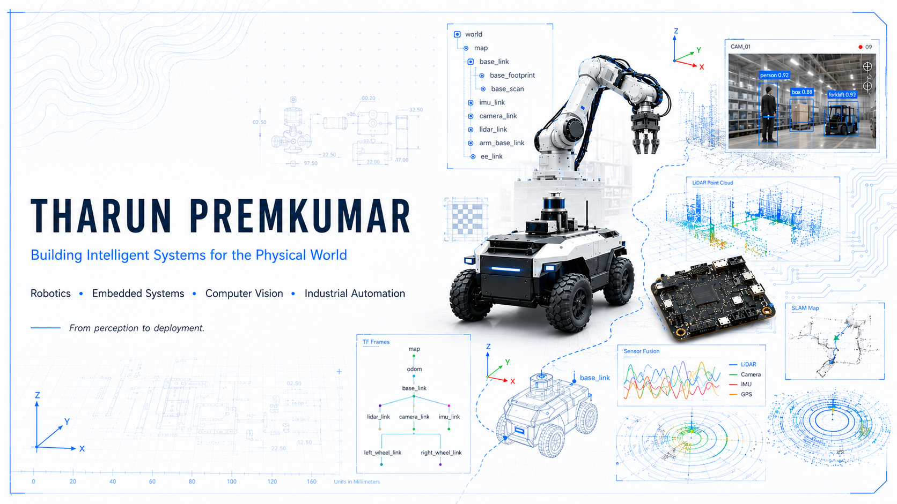
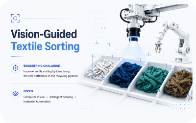
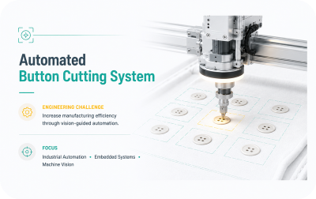

<picture>
  <source media="(prefers-color-scheme: dark)" srcset="Assets/dark/Banner_dark.png">
  <source media="(prefers-color-scheme: light)" srcset="Assets/light/Banner_light.png">
  
</picture>

# THARUN PREMKUMAR

### Building Intelligent Systems for the Physical World

---

# Engineering Philosophy

I believe engineering begins by understanding **where a system fails**, not by selecting the technologies used to solve it.

Rather than optimizing individual components, I first identify the highest-impact bottleneck before designing a complete solution. This systems-first mindset shapes how I approach robotics, embedded systems, computer vision, and industrial automation.

---

# Featured Engineering Systems

<a href="https://github.com/itz-tharun/Automated-Arm-Based-textile-sorter">
  <picture>
    <source media="(prefers-color-scheme: dark)" srcset="Assets/dark/Card1_dark.svg">
    <source media="(prefers-color-scheme: light)" srcset="Assets/light/Card1_light.svg">
    
  </picture>
</a>

<a href="https://github.com/itz-tharun/Automated-Button-Cutter-with-Yolo-detection">
  <picture>
    <source media="(prefers-color-scheme: dark)" srcset="Assets/dark/Card2_dark.svg">
    <source media="(prefers-color-scheme: light)" srcset="Assets/light/Card2_light.svg">
    
  </picture>
</a>

 

---

# Publications

Current research includes:

- **Computer Vision for Intelligent Waste Classification** *(In Preparation)*
- **Efficient Vision Algorithms for Industrial Automation** *(In Preparation)*

My research primarily explores the intersection of computer vision, intelligent sensing, and industrial automation, with an emphasis on practical deployment under real-world constraints.

---

# Professional Journey

<picture>
  <source media="(prefers-color-scheme: dark)" srcset="Assets/dark/timeline_journey_dark.svg">
  <source media="(prefers-color-scheme: light)" srcset="Assets/light/timeline_journey_light.svg">
  
</picture>

---

# Engineering Toolkit

### Programming

### Robotics & Simulation

### Computer Vision

### Embedded Systems

### Engineering Tools

 

  

