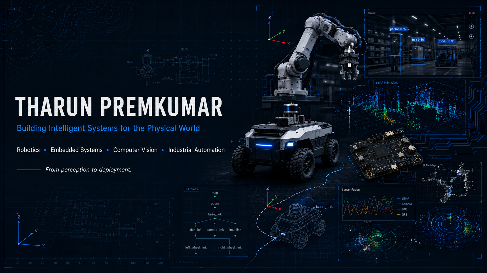

# THARUN PREMKUMAR

### Building Intelligent Systems for the Physical World

---

# Engineering Philosophy

I believe engineering begins by understanding **where a system fails**, not by selecting the technologies used to solve it.

Whether the challenge involves industrial automation, autonomous robotics, or intelligent sensing, I first aim to identify the highest-impact bottleneck before designing a complete solution. Depending on the problem, that solution may combine computer vision, embedded systems, robotics, control systems, or automation—but the technology is always driven by the problem, never the other way around.

This systems-first mindset has shaped my work across research, international internships, and real-world engineering projects, and continues to guide how I approach complex engineering challenges.

---

# Research Interests

- Robotics & Autonomous Systems
- Computer Vision & Intelligent Sensing
- Embedded Systems & Edge Computing
- Industrial Automation
- Intelligent Physical Systems

---

# Featured Engineering Systems

I'm currently restructuring my repositories to better document the engineering decisions behind each project.

Rather than simply showcasing completed work, each repository is being redesigned as a technical case study covering:

- Problem Definition
- System Architecture
- Design Decisions
- Hardware & Software Integration
- Experimental Results
- Engineering Challenges
- Lessons Learned
- Future Improvements

The featured engineering systems below will serve as the primary showcase of my work in robotics, embedded systems, computer vision, and industrial automation.
---

# Publications

Current research includes:

- **Computer Vision for Intelligent Waste Classification** *(In Preparation)*
- **Efficient Vision Algorithms for Industrial Automation** *(In Preparation)*

My research primarily explores the intersection of computer vision, intelligent sensing, and industrial automation, with an emphasis on practical deployment under real-world constraints.

---

# Professional Journey

---

# ⚙ Engineering Toolkit

### Programming

Python • C • C++ • Embedded C

### Robotics

ROS 2 • Motion Planning • Gazebo • Control Systems

### Computer Vision

OpenCV • Image Processing • YOLO • Intelligent Sensing

### Embedded Systems

Arduino • ESP32 • Raspberry Pi • Microcontrollers

### Engineering

Linux • Git • MATLAB

 

  

